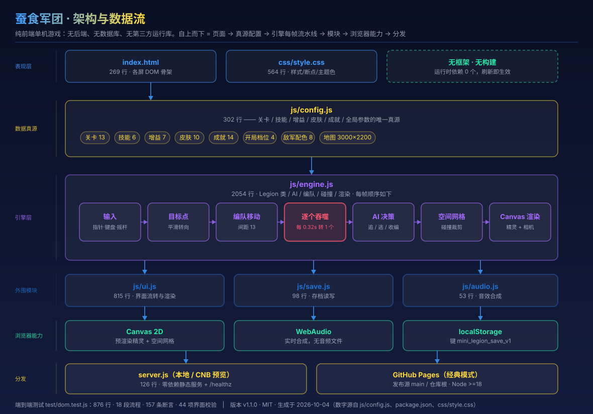
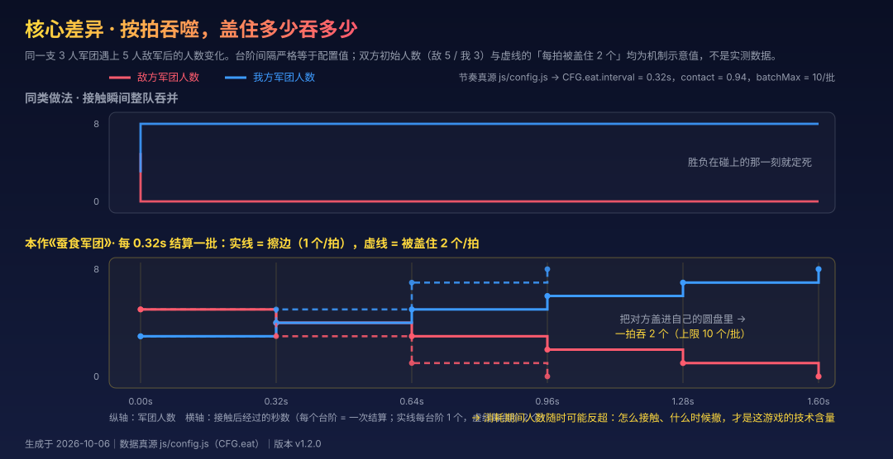
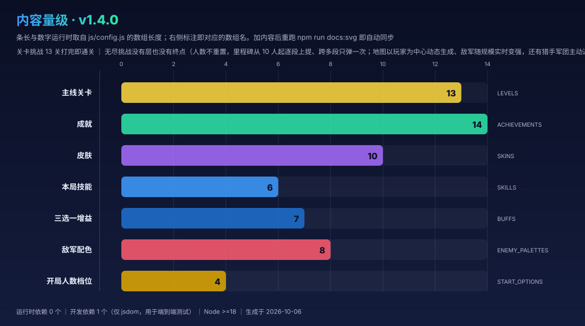

# 蚕食军团（Salami Legion）

[](package.json)
[](LICENSE)
[](#技术栈)
[](#技术栈)
[](package.json)
[](https://github.com/LPK3215/salami-legion/graphs/commit-activity)
[](https://lpk3215.github.io/salami-legion/)
[](CONTRIBUTING.md)

| 入口 | 地址 | 该给谁看 |
|---|---|---|
| 🎮 在线试玩（**推荐分享这个**） | <https://lpk3215.github.io/salami-legion/>（发布源为 `main` 分支仓库根，push 即自动更新） | 想玩的人 —— 打开就是游戏本体，零下载零登录 |
| 📊 项目全景观览 | <https://lpk3215.github.io/salami-legion/project_overview/> | 想了解“它能干什么、怎么实现的”的人（本地可直接双击根目录 `project_overview.html`） |
| 📦 仓库地址 | <https://github.com/LPK3215/salami-legion>（clone：`git clone https://github.com/LPK3215/salami-legion.git`） | 想读代码 / 提 PR 的人 |
| 📝 变更历史 | [CHANGELOG.md](CHANGELOG.md) ｜ 常见疑问：[FAQ.md](FAQ.md) ｜ 开发文档：[docs/](docs/01-gameplay.md) | — |

> 两个页面**互相连通**：游戏主菜单底部「项目介绍」→ 览页（新标签，不丢进度）；
> 览页 Hero 与正文中段各有「立即开玩」→ 游戏本体。根路径始终是游戏，因为分享链接的第一动作是“玩”而不是“读”。

> 徽章里 `version` / `language` / `jsdom` / `commit activity` 是 shields.io **动态端点**，实时读仓库；
> `license` 与 `runtime deps` 写死，它们的真源分别是 [LICENSE](LICENSE) 与 `package.json`（无 `dependencies` 字段）。

一款休闲 IO 风格的**军团吞噬对战**游戏。你操控一整支彩色小人军团在地图上滑行，
碰到的中立小人会自动加入你，撞上别的军团则会爆发战斗。

**和市面上同类游戏最大的区别**：两支军团接触后**不会一次性吞并整队**，而是
每 0.32 秒结算一批 —— **对面有多少小人被你盖在自己的圆盘里，这一拍就一口气吞掉多少个**；
只擦到边缘则一拍只吞 1 个。所以「什么时候冲、从哪里压进去、什么时候跑」
才是这个游戏真正的技术含量。

同时本作还叠加了市面同类产品少见的**关卡推进 + 技能 + 三选一奖励 + 金币皮肤成就**成长体系。

---

## 一图看懂

下面三张图由仓库内脚本生成（**图里的数字运行时从真源读取，不是手写**），改代码后重跑即可同步：

```bash
npm run docs:svg
```

### 架构与数据流



### 核心差异：按拍吞噬（擦边逐个吞、覆盖同批吞）



### 内容量级



### 界面截图

<!-- TODO: 截图待补充 -->

主菜单 / 出征准备 / 对局 / 结算三选一 / 皮肤商店 / 无尽模式大规模军团 的实际画面。本项目**仓库内不存放任何
二进制素材**（画面由 Canvas 绘制、音效由 WebAudio 合成），因此截图不入库，
直接访问[在线试玩地址](https://lpk3215.github.io/salami-legion/)查看实时效果。

---

## 一分钟上手

1. 打开游戏 → 主菜单点 **关卡挑战**（或 **无尽挑战**）
2. 出征准备页：选**开局军团人数**，再选**本局要带的 1 个技能**
3. 进入对局，控制整支军团移动（两种设备都支持，见下）
4. 去吃白色中立小人壮大自己；看到**绿色标记**的敌军（人比你少）就冲上去吞掉它；
   看到**红色标记**的敌军（人比你多）立刻跑
5. 关卡挑战：达成关卡目标 → 结算 → **三选一奖励** → 进入下一关
   无尽挑战：人数一路涨，达成里程碑（**首个 10 人，之后每段增量逐段上提**：10 → 50 → 100 → 160 …）
   会在战场上浮出**半透明**三选一，**点一张卡就直接生效并接着打**

### 操作方式

| 设备 | 移动 | 技能 |
|---|---|---|
| **电脑** | 移动鼠标即可（军团跟随光标，带十字准星）；也可以 `W A S D` / `↑ ← ↓ →`，**支持同时按两个键斜向走** | `空格` / `E`，或点右下角按钮 |
| **手机 / 平板** | **按住屏幕任意位置出现虚拟摇杆**，拖动方向即移动方向，拖得越远走得越快；摇杆**中心锁定**，拖不出屏幕 | 点右下角圆形按钮（可与摇杆多指同时操作） |

- 暂停：`Esc` 或 `P`（也可以点右上角按钮）；切到后台自动暂停。
- **惯性而行（默认开）**：抬起手指 / 松开方向键后，军团沿最后方向继续走，你只控制方向；
  想停就把摇杆**拉回中心**，或同时按住两个相反方向键（`A+D` / `W+S`）。
  主菜单的 **「惯性」** 可切回旧手感「松手即停」。
- 不习惯摇杆？主菜单点 **「操作」** 可切换为「跟随手指 / 指针：点哪走哪」。
- 想了解机制与数值？主菜单底部的 **「项目介绍」** 会打开全景观览页（不影响当前进度）。
- 完整方案与参数见 [docs/05-controls-and-layout.md](docs/05-controls-and-layout.md)。

---

## 两种游戏模式

| 模式 | 说明 | 终点 |
|---|---|---|
| **关卡挑战** | 主线 13 关，一关一关推进。每关目标为「达到 N 人」或「消灭所有敌军」，达成即结算并进入下一关 | 打完第 13 关通关 |
| **无尽挑战** | **没有层、没有关卡**：一整场连续对局，人数只增不减；里程碑要求逐段上提（10 → 50 → 100 → 160 …），达成时半透明浮层三选一、点卡即续战；**地图是以你为中心的动态战场**（走到哪生成到哪，半径随规模变化、没有墙），敌军规模也随你实时变强 | 没有终点，直到你被打光 |

两种模式都是「**一次挑战 = 先选技能与开局人数**」，
中途靠三选一奖励不断变强；一旦失败，这次挑战结束，金币保留。
区别是关卡挑战**每关人数从头开始**，而无尽挑战**人数一个都不会重置**。

详细说明见 **[docs/02-modes.md](docs/02-modes.md)**。

---

## 文档索引

| 文档 | 内容 |
|---|---|
| [docs/01-gameplay.md](docs/01-gameplay.md) | **玩法指南**：操作、按拍吞噬机制详解、局势判断、新手上路 |
| [docs/02-modes.md](docs/02-modes.md) | **游戏模式**：关卡挑战 / 无尽挑战 / 关卡选择，全部数值与差异 |
| [docs/03-systems.md](docs/03-systems.md) | **系统详解**：技能、增益、三选一奖励、成就、商店、存档 |
| [docs/04-development.md](docs/04-development.md) | **开发者文档**：架构、文件职责、引擎 API、如何加关卡、测试与部署 |
| [docs/05-controls-and-layout.md](docs/05-controls-and-layout.md) | **跨端操作与布局**：鼠标/键盘/虚拟摇杆、多指处理、屏幕分区与断点适配 |
| [project_overview/](project_overview/index.html) | **项目全景观览页**：单页仪表盘（架构、机制对比、数值表格、目录树、API、文档索引），本地双击根目录 `project_overview.html` 即可打开；线上：<https://lpk3215.github.io/salami-legion/project_overview/>。页面数字由 `npm run overview:data` 从源码抽取，不手抄 |

---

## 快速运行

纯前端游戏，零运行时依赖。

```bash
# 方式一：本地静态服务（推荐）
npm start                     # 等价于 node server.js，默认监听 0.0.0.0:8080

# 方式二：直接双击打开
#   index.html 即可（部分浏览器对 file:// 的 localStorage 有限制，建议用方式一）

# 方式三：CNB 云开发环境（本仓库已配置好）
bash scripts/start.sh         # 幂等启动，自动打印网关预览地址
```

CNB 云原生开发环境下，打开开发环境时会由 `.cnb.yml` 里的 `CNB_WELCOME_CMD`
自动执行 `scripts/start.sh` 把服务拉起来，并通过 `$CNB_VSCODE_PROXY_URI`
（形如 `https://xxxx-{{port}}.cnb.run`）转发到浏览器。

## 测试

```bash
npm test                      # jsdom 端到端测试：真实点击全部界面 + 验证核心玩法
```

---

## 技术栈

- 前端：原生 HTML5 + CSS3 + ES6（无框架、无构建步骤）
- 渲染：Canvas 2D（预渲染精灵 + 空间网格）
- 音效：WebAudio 实时合成（无音频资源文件）
- 存档：localStorage（键名 `mini_legion_save_v1`，与产品名解耦，改名不动键）
- 服务：Node.js 零依赖静态服务器
- 测试：Node.js + jsdom
- 文档图表：`scripts/visualization/` 下的 Node 生成器输出 SVG 与览页数据 facts.js（仅用内置模块，不引入外部运行时）

> 本项目**没有后端服务、没有数据库**，是纯浏览器端游戏。

---

## 仓库结构

行数与内容数量均由 `scripts/visualization/lib_load_facts.mjs` 口径统计（按换行计，同 `wc -l`），供定位改动位置参考。

```text
salami-legion/
├── index.html             页面骨架与各屏 DOM（292 行）
├── css/style.css          全部样式、断点适配、动画（597 行）
├── js/
│   ├── config.js          数值与内容真源：关卡/技能/增益/皮肤/成就（331 行）
│   ├── engine.js          核心引擎：按拍吞噬（盖住同批吞）、摇杆锁定与惯性而行、编队移动、AI、渲染（2204 行）
│   ├── ui.js              界面流转与交互（897 行）
│   ├── save.js            localStorage 存档读写（102 行）
│   └── audio.js           WebAudio 实时合成音效（53 行）
├── server.js              零依赖静态服务器（126 行，仅本地/云开发预览用）
├── scripts/
│   ├── start.sh            CNB 云开发环境幂等启动脚本
│   └── visualization/     图表生成器（仅用 Node 内置模块）
│       ├── lib_load_facts.mjs              共享层：从真源读全部数字
│       ├── generate_architecture_svg.mjs    → docs/architecture.svg
│       ├── generate_attrition_mechanic_svg.mjs → docs/attrition-mechanic.svg
│       ├── generate_content_scale_svg.mjs   → docs/content-scale.svg
│       └── generate_overview_facts.mjs      → project_overview/facts.js
├── test/dom.test.js        jsdom 端到端测试（1086 行）
├── docs/                   5 篇玩法与开发文档 + 3 张生成的 SVG（见上方文档索引与「一图看懂」）
├── project_overview/        项目全景观览页（index.html + style.css + script.js + charts.js + 生成的 facts.js）
├── project_overview.html    根目录入口（meta refresh 跳转）
├── .nojekyll               告知 GitHub Pages 不要走 Jekyll
├── .cnb.yml                CNB 云开发环境配置
├── LICENSE · CONTRIBUTING.md · CHANGELOG.md · FAQ.md
├── SECURITY.md · CODE_OF_CONDUCT.md · AUTHORS
└── .gitignore · .gitattributes · .editorconfig · package.json · package-lock.json
```

> 部署说明：GitHub Pages **经典模式（legacy）**，发布源是 **`main` 分支的仓库根目录**
> （不是 `docs/`，`docs/` 放的是开发文档）。改动 push 到 `main` 后自动构建发布，
> 不依赖 GitHub Actions。

## 参与贡献

玩法、数值、UI 都欢迎改，但请先读 [CONTRIBUTING.md](CONTRIBUTING.md) —— 里面有一条红线：
**存档键 `mini_legion_save_v1` 不许改**，改了等于把全部玩家的金币、关卡进度、皮肤、成就清零。

- 贡献流程与代码约束：[CONTRIBUTING.md](CONTRIBUTING.md)
- 变更历史：[CHANGELOG.md](CHANGELOG.md)
- 常见问题：[FAQ.md](FAQ.md)
- 安全漏洞报告（请勿开公开 Issue）：[SECURITY.md](SECURITY.md)
- 行为准则：[CODE_OF_CONDUCT.md](CODE_OF_CONDUCT.md)

## 许可与作者

- [MIT](LICENSE) 许可证，版权 © 2026 LPK3215
- 作者与维护者：[AUTHORS](AUTHORS)
- 无外部素材：画面由 Canvas 绘制，音效由 WebAudio 实时合成
